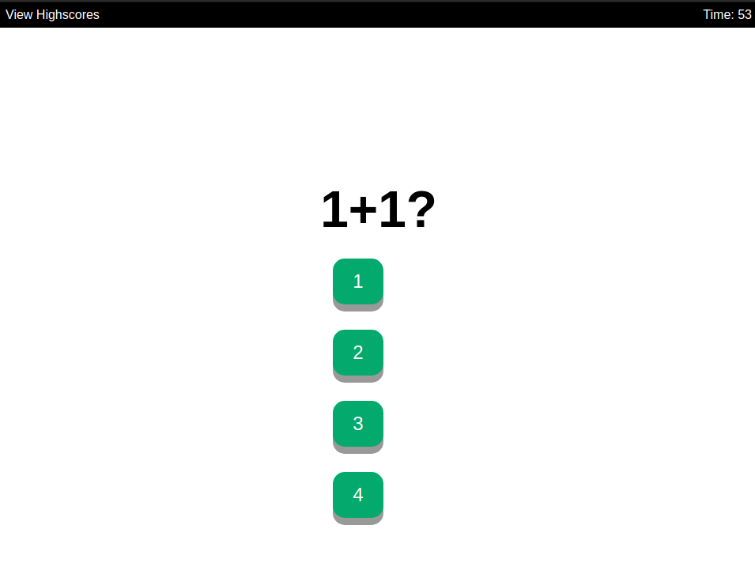

# Timed Quiz

## Screenshot

## Links
GitHub: https://github.com/Yoonbacca/timed-quiz

Live Page: https://yoonbacca.github.io/quiz

## Description
This is a timed quiz website built entirely using the JS and the DOM. The purpose of this project was to practice different methods of navigating the DOM while also using localStorage to store data on the browser's memory.

When clicking the "Start Quiz" button, the user will be guided through 5 multiple choice questions that each have one correct answer. The DOM will dynamically update the header and list elements with questions and options for the user. They will be timed on the quiz for 60 seconds.

If the user selects the wrong answer, the score will remove 10 seconds from the timer. At the end of the quiz, the user will be prompted to save their score by typing in their name. Once this is done, the user will then be able click the "View Highscores" text at the top nav bar to have an alert display the high scores to them.

## How to Install and Run the Project 
You can either clone the repo and preview index.html within an IDE or access the page at https://yoonbacca.github.io/timed-quiz
